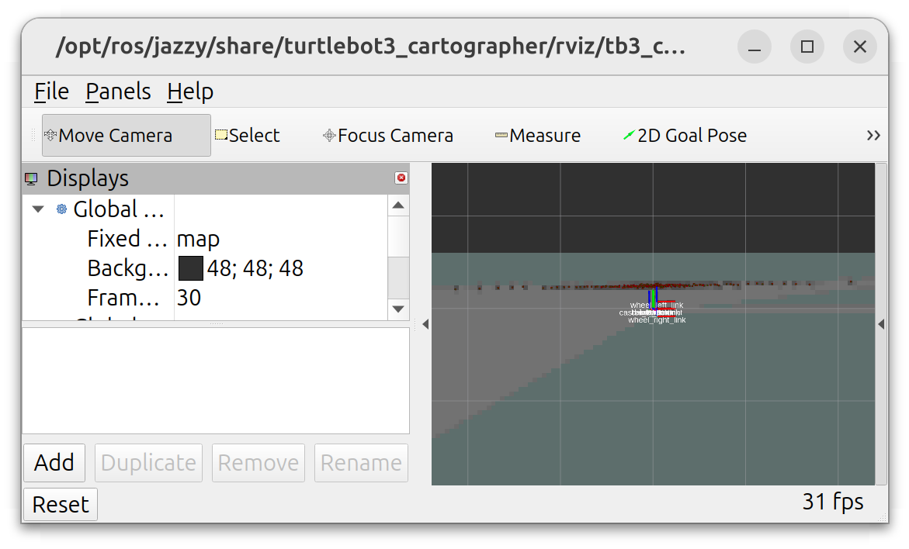

2&emsp;SLAM and Localization
==============

***EE3305/ME3243 Robotic System Design***

**&copy; National University of Singapore**

ROS2 SLAM and navigation with ROS2 Nav2 are shown in this chapter. 
The map that is generated by the SLAM in this chapter will be used by the subsequent chapters.

# Table of Contents

[1&emsp;Simulating SLAM with Cartographer](#1simulating-slam-with-cartographer)

[2&emsp;Simulating Navigation with Nav2](#2simulating-navigation-with-nav2)


# 1&emsp;Simulating SLAM with Cartographer
In this section, we map a simulated environment to obtain its map. 

Click the thumbnail below to access the Youtube video on a demo to SLAM effectively. Please also read the video's description.

[](https://www.youtube.com/watch?v=cWqKkIKjVyw)


1. In Ubuntu, open a terminal with `Ctrl+Alt+T`, or use an existing terminal. Let this be terminal `A`. 
   
2. If the `ee3305` workspace has not been built, change directory into the workspace and build the workspace.

    ```bash
    cd ~/ee3305   # if terminal is not in workspace
    colcon build --symlink-install
    ```

3. Source the workspace installation directories if they have not already been sourced (only need to be done once for any terminal).

    ```bash
    cd ~/ee3305   # if terminal is not in workspace
    source install/setup.bash
    ```

4. Launch the SLAM simulation. The following shows the launch arguments applicable for this project.

    <table><tbody>
        <tr>
            <th>Launch Argument</th>
            <th>Launch Value</th>
        </tr>
        <tr>
            <td rowspan="2"><code>headless</code></td>
            <td><code>False</code>. Default. Opens the 3D graphic user interface for Gazebo.</td>
        </tr>
        <tr>
            <td><code>True</code>. Runs the simulation in the background without opening the interface. This option is easier on the computer.</td>
        </tr>
        <tr>
            <td rowspan="2"><code>libgl</code></td>
            <td><code>False</code>. Default. Meant for single/dual boot users. VirtualBox users will not be able to launch the simulation with this value.</td>
        </tr>
        <tr>
            <td><code>True</code>. Meant for <b>VirtualBox</b> users.</td>
        </tr>
    </tbody></table>


    - For **single or dual boot** users, the launch arguments and values can be used as follows:

        ```bash
        ros2 launch ee3305_bringup sim_slam.launch.py headless:=False libgl:=False
        ```

    - For **virtualbox** users, the launch arguments and values can be used as follows. `libgl` must be set to `True`.

        ```bash
        ros2 launch ee3305_bringup sim_slam.launch.py headless:=False libgl:=True
        ```

    Errors on the terminal from Rviz, and those from gazebo involving `SystemPaths.cc`, can be **ignored**.

    


4. After launching, RViz and Gazebo will open. The initial view in RViz is rotated $90^\circ$ clockwise from the Gazebo's view. The robot is initially pointing to the right in RViz, and to the top in Gazebo.

    

    

5. Open a new terminal `B` either by `Ctrl+Alt+T` or organizing the terminals by `Ctrl+Shift+O` (assuming Terminator is used) in terminal `A`.

6. In terminal `B`, start tele-operation with:
    ```bash
    export TURTLEBOT3_MODEL=burger
    ros2 run turtlebot3_teleop teleop_keyboard
    ```

7. Begin moving the robot around the map using tele-operation while using SLAM to contruct the occupancy grid in RViz. Take about 10 minutes to map the whole area. The following tips will be useful:

    - The tele-operation is not initially intuitive. If you crash into the wall and the robot is unable to recover, interrupt both terminals `A` and `B` with `Ctrl+C`, and restart from Step 4.

    - Pan and orbit the camera in RViz with `Shift+Drag` and `Drag` respectively. Drag by holding the mouse button and moving across the screen.

    - Pan and orbit the camera in Gazebo graphic user interface with `Drag` and `Shift+Drag` respectively.
      
    - After interacting with other windows, always click on terminal B to resume tele-operation. When terminal B is not active, any key presses meant for tele-operation will not be captured.
  
    When complete, the background map on RViz may look like the following. It is alright to see more white spaces.
   
   
8. In a new or existing terminal `C`, save the map into the `ee3305_bringup` package:
    ```bash
    cd ~/ee3305   # if terminal is not in workspace
    ros2 run nav2_map_server map_saver_cli -f src/ee3305_bringup/maps/ee3305
    ```
    This will create two new files, `ee3305.yaml` and `ee3305.pgm`, in the [src/ee3305_bringup/maps/](../src/ee3305_bringup/maps/) directory. These two files describe the occupancy grid generated by the SLAM process.
    
10. In terminal `C`, install the saved map so that the map can be found by ROS:
    ```bash
    cd ~/ee3305   # if terminal is not in workspace
    colcon build --symlink-install
    ```

11. After the build completes, `Ctrl+C` terminals `A` and `B` to stop the SLAM and teleoperation.

12. Gazebo may occasionally stay open even if `Ctrl+C` is sent. In any terminal, run the following to kill all Ruby scripts that are used to launch Gazebo. The following command will kill other ruby scripts as well (use `top` to check), but is not a problem as no critical applications used by this course use Ruby.

    ```bash
    pkill -9 ruby
    ```
    
# 2&emsp;Simulating Navigation with Nav2
In this section, the map created from SLAM is used for navigation by the ROS2 Nav2 software. 
This section provides some background and context on robotic navigation, and is not required for the project.

1. In a new or existing terminal, source the workspace installation directories if they have not already been sourced (only need to be done once for any terminal).

    ```bash
    cd ~/ee3305   # if terminal is not in workspace
    source install/setup.bash
    ```

2. Launch the navigation. The launch arguments are the same as SLAM launch. If **virtualbox** is used, please change `libgl` to `True`. 

    ```bash
    ros2 launch ee3305_bringup sim_nav2.launch.py headless:=True libgl:=False
    ```
    
3. Observe the starting pose (position and rotation) of the robot in Gazebo, and find the corresponding position in RViz. Both views are now pointing in the same direction, which is different from the SLAM section. 

4. On RViz, click `2D Pose Estimate`, and click the robot's position in RViz. The position should correspond to the map axes on RViz.

    


5. Wait for a few seconds and the map would be filled with inflation layers in RViz, and the initial position is filled with green particles representing guesses of the robot's position in AMCL.
    
    

6. Click `Nav2 Goal`, and create a goal pose in RViz like the step above.

    

7. A path will be generated around the obstacles between the robot and the goal position.

    

    The task for project 1 is to program a path planner (Dijkstra) to generate the path, and program a pure-pursuit controller to follow the path.

9. Stop the navigation by sending a `Ctrl+C` in the terminal. `pkill -9 ruby` may be used if Gazebo does not terminate properly.
