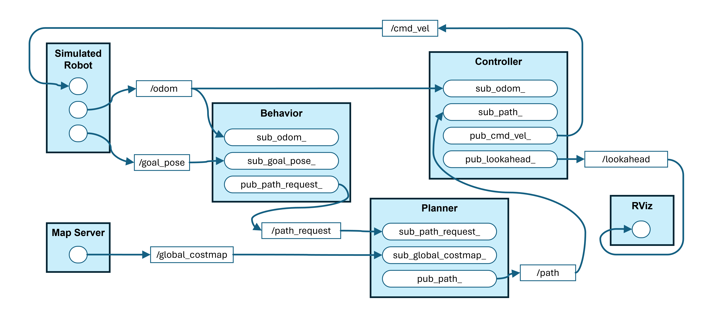
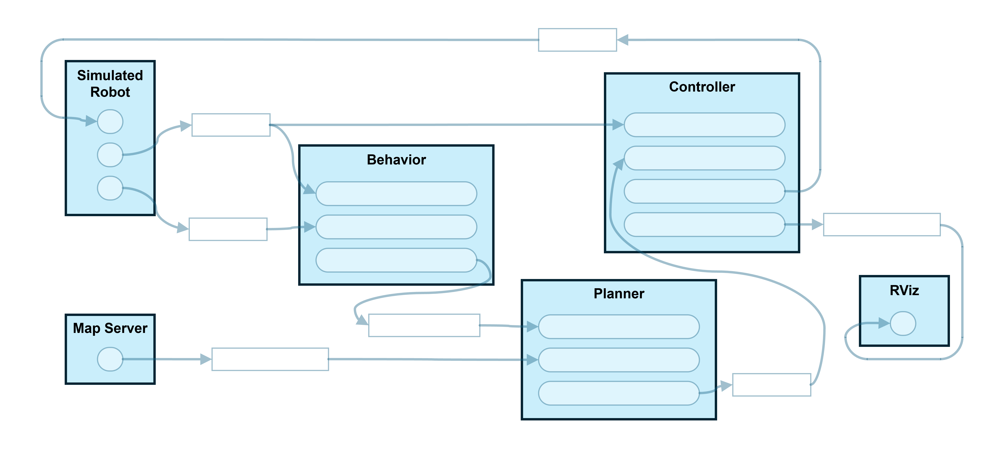
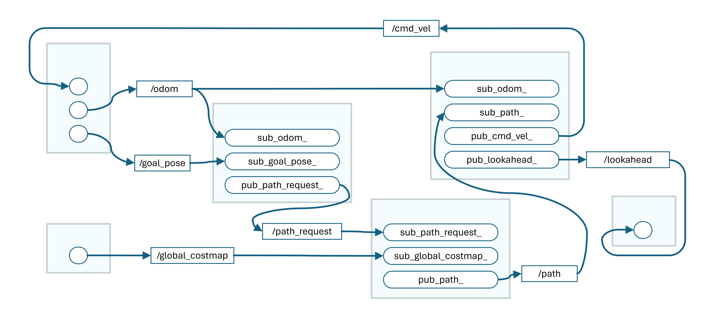
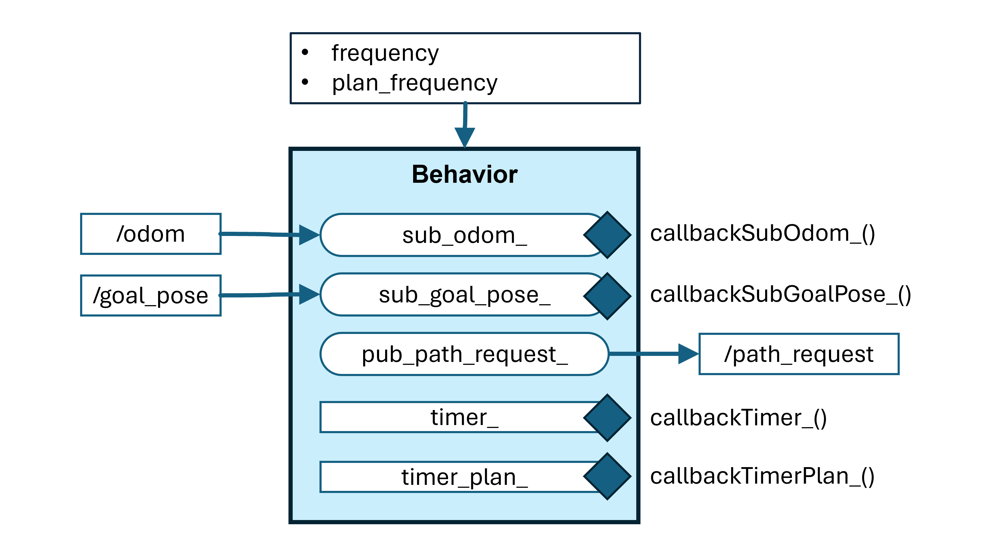
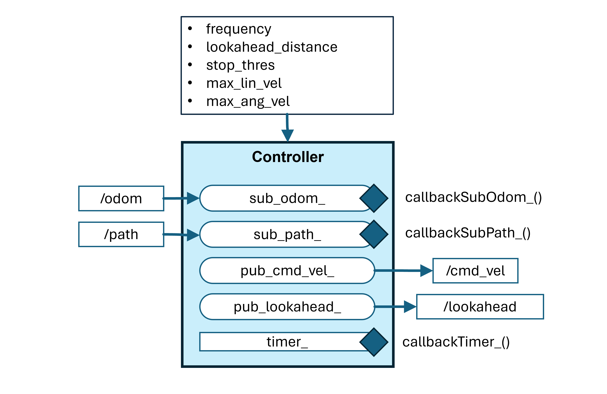
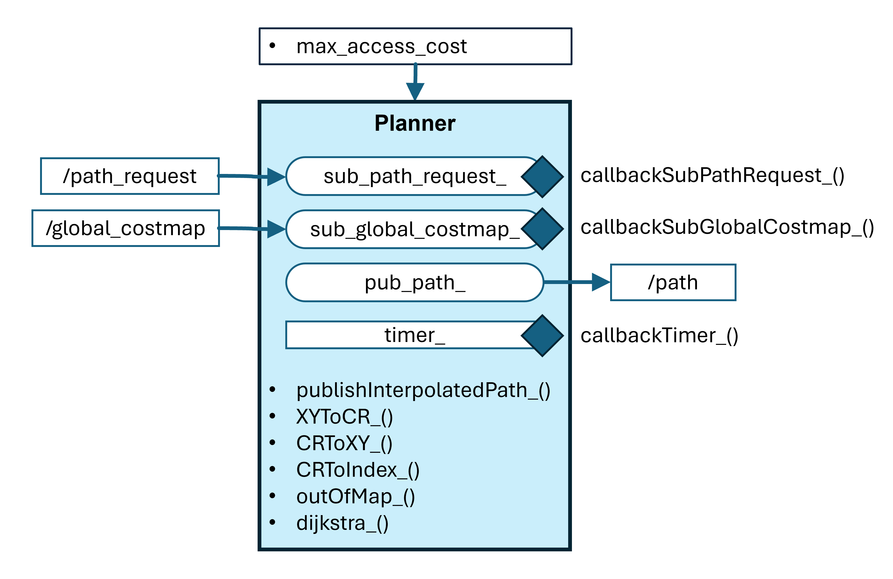
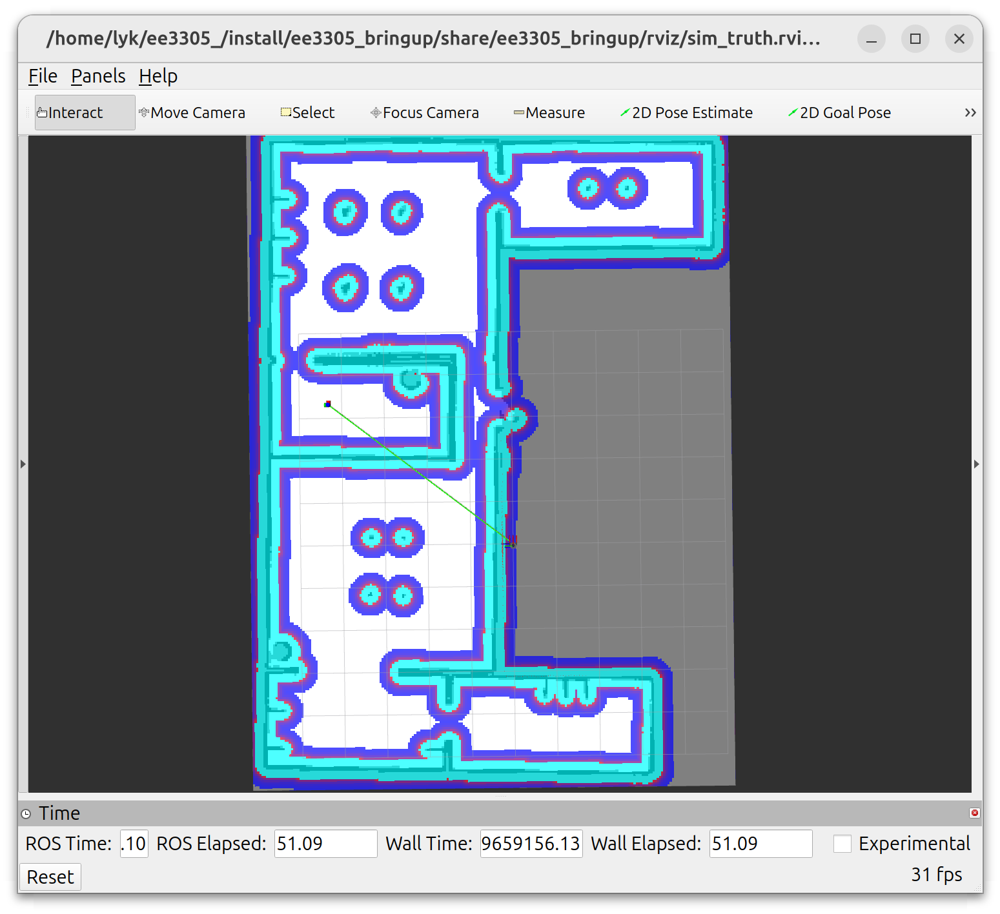

3&emsp;ROS System
---

***EE3305/ME3243 Robotic System Design***

**&copy; Lai Yan Kai, National University of Singapore**

The Robot Operating System (ROS) is a suite of software tools and libraries to standardize robotic software development.
Standardization is important so that software can be easily run and troubleshooted, especially when code from different industrial or academic groups are used.

In this chapter, we go through the basic elements of ROS, and learn about the basic syntax to allow the different parts of a robot system communicate with one another.

You are allowed to use either Python or C++ for the project. 
C++ will be used in EE4308 because robotic software development for high-performing systems are all in C++.
To use Python, go to the [`ee3305_py`](../src/ee3305_py/) package and find the `.py` files. To use C++, go to the [`ee3305_cpp`](../src/ee3305_cpp/) package and find the `.cpp` files.

# Table of Contents

[1&emsp;The Project Design](#1the-project-design)

&emsp;[1.1&emsp;Nodes](#11nodes)

&emsp;[1.2&emsp;Topics](#12topics)

&emsp;[1.3&emsp;Callbacks ](#13callbacks)

&emsp;[1.4&emsp;Timer](#14timer)

[2&emsp;Python and C++ Templates](#2python-and-c-templates)

&emsp;[2.1&emsp;Subscriber Template in Node Constructor](#21subscriber-template-in-node-constructor)

&emsp;[2.2&emsp;Publisher Template in Node Constructor](#22publisher-template-in-node-constructor)

&emsp;[2.3&emsp;Subscriber Callback](#23subscriber-callback)

[3&emsp;Behavior Node](#3behavior-node)

&emsp;[3.1&emsp;Relevant File](#31relevant-file)

&emsp;[3.2&emsp;Initialize Goal Pose Subscriber](#32initialize-goal-pose-subscriber)

&emsp;[3.3&emsp;Initialize Odometry Subscriber](#33initialize-odometry-subscriber)

&emsp;[3.4&emsp;Initialize Path Request Publisher](#34initialize-path-request-publisher)

&emsp;[3.5&emsp;Program Goal Pose Subscriber Callback](#35program-goal-pose-subscriber-callback)

&emsp;[3.6&emsp;Program Odometry Subscriber Callback](#36program-odometry-subscriber-callback)

&emsp;[3.7&emsp;Publish Path Request](#37publish-path-request)

[4&emsp;Controller Node](#4controller-node)

&emsp;[4.1&emsp;Relevant File](#41relevant-file)

&emsp;[4.2&emsp;Initialize Path Subscriber](#42initialize-path-subscriber)

&emsp;[4.3&emsp;Initialize Odometry Subscriber](#43initialize-odometry-subscriber)

&emsp;[4.4&emsp;Initialize Command Velocity Publisher](#44initialize-command-velocity-publisher)

&emsp;[4.5&emsp;Initialize Lookahead Point Publisher](#45initialize-lookahead-point-publisher)

&emsp;[4.6&emsp;Program Path Subscriber Callback](#46program-path-subscriber-callback)

&emsp;[4.7&emsp;Program Odometry Subscriber Callback](#47program-odometry-subscriber-callback)

&emsp;[4.8&emsp;Publish Command Velocity](#48publish-command-velocity)

&emsp;[4.9&emsp;Publish Lookahead Point](#49publish-lookahead-point)

[5&emsp;Planner Node](#5planner-node)

&emsp;[5.1&emsp;Relevant File](#51relevant-file)

&emsp;[5.2&emsp;Initialize Global Costmap Subscriber](#52initialize-global-costmap-subscriber)

&emsp;[5.3&emsp;Initialize Path Request Subscriber](#53initialize-path-request-subscriber)

&emsp;[5.4&emsp;Initialize Path Publisher](#54initialize-path-publisher)

&emsp;[5.5&emsp;Program Path Request Subscriber Callback](#55program-path-request-subscriber-callback)

&emsp;[5.6&emsp;Program Global Costmap Subscriber Callback](#56program-global-costmap-subscriber-callback)

&emsp;[5.7&emsp;Publish Path](#57publish-path)

[6&emsp;Building](#6building)

[7&emsp;Testing](#7testing)

# 1&emsp;The Project Design

The image below depicts the nodes and topics in the project's ROS system.




## 1.1&emsp;Nodes

Nodes are processes in the ROS system which are run simultaneously. They implement one component of a robotic system.
In this project, the **Behavior**, **Planner**, and **Controller** nodes will be implemented. 

- The **behavior** node is the decision maker that controls how often paths should be planned and directs the robot to the clicked goal pose.
- The **planner** node finds a path around obstacles based on the start and goal coordinates provided by the behavior node. The path is found using Dijkstra.
- The **controller** node follows the path found by the planner node. Pure pursuit is used to follow the path.

Other nodes exist in the system but they need not be implemented. The nodes implementing the simulation are lumped together into *Simulated Robot* in the diagram below. The map server provides the map found using SLAM, and RViz visualizes the robot and topics. 




## 1.2&emsp;Topics

Nodes communicate with each other using **topics**. 
Every topic contains a message that is a certain type.
A topic subscriber receives messages, while a topic publisher transmits messages.
Every node can have multiple subscribers and publishers on different topics.




## 1.3&emsp;Callbacks 
In programming, callbacks are used to asynchronously receive messages and run instructions at fixed intervals of time. The focus of the project would be to program these callbacks so that the robotic system can run as intended.

When programming callbacks, keep in mind that callbacks must run and terminate quickly. In the default implementation, callbacks within a node are run one after another and not simultaneously. 
If a callback is run for too long or waits indefinitely, other callbacks are delayed or not run, and the node may not run as intended. 

Keeping callbacks short is particularly when it comes to topics. Messages are processed by subscriber callbacks. 
Delaying subscriber callbacks because of another slow callback can prevent the node from running on the most updated information.
A planner or controller that acts on outdated information can cause the robot to crash.

## 1.4&emsp;Timer
The timer controls how frequently a callback is run. 
This is useful for implementing controllers that need to be run at a fixed frequency, and logic that needs to be run in a loop without blocking other callbacks. 
The timer callback is just like any other callback and must run and terminate quickly.

# 2&emsp;Python and C++ Templates

In the subsequent sections, the topic subscribers, publishers, and subscriber callbacks are implemented. The templates and in this section should be used when implementing them.

## 2.1&emsp;Subscriber Template in Node Constructor

A subscriber should be initialized in its **node's class constructor**. In Python, the constructor is the function `__init__()`. In C++, the constructor function has the same name as the class and begins with the `explicit` keyword.

<table><tbody>
    <tr>
        <td><b>Node Class</b></td>
        <td><code>NodeA</code>. C++ only.</td>
    </tr>
    <tr>
        <td><b>Handle</b></td>
        <td><code>sub_topic_a_</code></td>
    </tr>
    <tr>
        <td><b>Message Type</b></td>
        <td><code>MsgTypeA</code>. For C++, use <code>lib_a::msg::MsgTypeA</code>. </td>
    </tr>
    <tr>
        <td><b>Topic</b></td>
        <td><code>"topic_a"</code></td>
    </tr>
    <tr>
        <td><b>Callback</b></td>
        <td><code>callbackSubTopicA_</code></td>
    </tr>
    <tr>
        <td><b>QoS</b></td>
        <td><code>qos_a</code></td>
    </tr>
</tbody></table>

Match the syntax above to the template below, depending on the language your team has chosen for this project.

<table><tbody>
    <tr>
        <td><b>Python</b></td>
        <td>
<pre lang="python">
self.sub_topic_a_ = self.create_subscription(
    MsgTypeA,
    "topic_a",
    self.callbackSubTopicA_,
    qos_a,
)</pre>
        </td>
    </tr>
    <tr>
        <td><b>C++</b></td>
        <td>
<pre lang="cpp">
this->sub_topic_a_ = this->create_subscription&lt;lib_a::msg::MsgTypeA&gt;(
    "topic_a", 
    qos_a, 
    std::bind(&NodeA::callbackSubTopicA_, this, std::placeholders::_1)
);</pre>
        </td>
    </tr>
</tbody></table>

## 2.2&emsp;Publisher Template in Node Constructor

A publisher should be initialized in its node's class constructor. 
While subscribers use callbacks to process received messages, publishers rely on function calls to publish messages, and **do not require callbacks**.

<table><tbody>
    <tr>
        <td><b>Handle</b></td>
        <td><code>pub_topic_a_</code></td>
    </tr>
    <tr>
        <td><b>Message Type</b></td>
        <td><code>MsgTypeA</code>. For C++, use <code>lib_a::msg::MsgTypeA</code>. </td>
    </tr>
    <tr>
        <td><b>Topic</b></td>
        <td><code>"topic_a"</code></td>
    </tr>
    <tr>
        <td><b>QoS</b></td>
        <td><code>qos_a</code></td>
    </tr>
</tbody></table>

Match the syntax above to the template below, depending on the language your team has chosen for this project.

<table><tbody>
    <tr>
        <td><b>Python</b></td>
        <td>
<pre lang="python">
self.pub_topic_a_ = self.create_publisher(
    MsgTypeA, 
    "topic_a", 
    qos_a
)</pre>
        </td>
    </tr>
    <tr>
        <td><b>C++</b></td>
        <td>
<pre lang="cpp">
this->pub_topic_a_ = this->create_publisher&lt;lib_a::msg::MsgTypeA&gt;(
    "topic_a", 
    qos_a
);</pre>
        </td>
    </tr>
</tbody></table>

## 2.3&emsp;Subscriber Callback

A subscriber callback creates a local copy of a received message. The copied data is stored in the node instance's properties (variables). The subscriber callback is run once for every message. 

In the callback `CallbackSubTopicA_`, copy the message contents into the node instance. 
The message is of type `lib_a::msg::MsgTypeA`. 
By googling or using VSCode Intellisense, find the matching message property and copy the data into the corresponding node instance's variable.

<table><tbody>
    <tr>
        <td><b>Callback</b></td>
        <td><code>CallbackSubTopicA_</code></td>
    </tr>
    <tr>
        <td><b>Message Type</b></td>
        <td><code>lib_a::msg::MsgTypeA</code></td>
    </tr>
    <tr><th colspan="2"></th></tr>
    <tr>
        <td><code>instance_property_a_</code></td>
        <td rowspan="3">Description of the property's purpose. Find the message property that corresponds to the description.</td>
    </tr>
    <tr>
        <td><code>instance_property_b_</code></td>
    </tr>
    <tr>
        <td><code>instance_property_c_</code></td>
    </tr>
</tbody></table>

In the callback, match the syntax to the template below.

<table><tbody>
    <tr>
        <td><b>Python</b></td>
        <td>
<pre lang="python">
self.instance_property_a_ = msg.p.q.r # find the message property
self.instance_property_b_ = msg.p.s   # find the message property
self.instance_property_c_ = msg.p.t   # find the message property</pre>
        </td>
    </tr>
    <tr>
        <td><b>C++</b></td>
        <td>
<pre lang="cpp">
this->instance_property_a_ = msg->p.q.r // find the message property
this->instance_property_b_ = msg->p.s   // find the message property
this->instance_property_c_ = msg->p.t   // find the message property</pre>
        </td>
    </tr>
</tbody></table>

# 3&emsp;Behavior Node



The behavior node is the decision-maker of the robotic navigation system. 
In this section, the subscribers, publishers, and subscriber callbacks for the behavior node, will be implemented.


## 3.1&emsp;Relevant File

The following file will be relevant for this task. Choose either the Python or C++ file, depending on your chosen language.

<table><tbody>
    <tr>
        <th>Name</th>
        <th>Where</th>
        <th>Description</th>
    </tr>
    <tr>
        <td rowspan="2">Behavior code</td>
        <td>Python file located in <a href="../src/ee3305_py/ee3305_py/behavior.py"><code>src/ee3305_py/ee3305_py/behavior.py</code></a></td>
        <td rowspan="2">Program the ROS components in this file.</td>
    </tr>
    <tr>
        <td>C++ file located in <a href="../src/ee3305_cpp/src/behavior.cpp"><code>src/ee3305_cpp/src/behavior.cpp</code></a></td>
    </tr>
</tbody></table>

## 3.2&emsp;Initialize Goal Pose Subscriber
Subscribes to the goal pose sent by RViz. The table below shows the function and variable names to implement the topic subscriber.

<table><tbody>
    <tr>
        <th colspan="2">Goal Pose Subscriber</th>
    </tr>
    <tr>
        <td><b>Node Class</b></td>
        <td><code>Behavior</code>. C++ only.</td>
    </tr>
    <tr>
        <td><b>Handle</b></td>
        <td><code>sub_goal_pose_</code></td>
    </tr>
    <tr>
        <td><b>Message Type</b></td>
        <td><code>PoseStamped</code>. For C++, use <code>geometry_msgs::msg::PoseStamped</code>. </td>
    </tr>
    <tr>
        <td><b>Topic</b></td>
        <td><code>"goal_pose"</code></td>
    </tr>
    <tr>
        <td><b>Callback</b></td>
        <td><code>callbackSubGoalPose_</code></td>
    </tr>
    <tr>
        <td><b>QoS</b></td>
        <td><code>10</code></td>
    </tr>
</tbody></table>

## 3.3&emsp;Initialize Odometry Subscriber
Subscribes to the odometry messages, which contains the robot's pose and twist. The robot's pose is its position and orientation. The robot's twist is its linear and angular velocities.

<table><tbody>
    <tr>
        <th colspan="2">Odometry Subscriber</th>
    </tr>
    <tr>
        <td><b>Node Class</b></td>
        <td><code>Behavior</code>. C++ only.</td>
    </tr>
    <tr>
        <td><b>Handle</b></td>
        <td><code>sub_odom_</code></td>
    </tr>
    <tr>
        <td><b>Message Type</b></td>
        <td><code>Odometry</code>. For C++, use <code>nav_msgs::msg::Odometry</code>.</td>
    </tr>
    <tr>
        <td><b>Topic</b></td>
        <td><code>"odom"</code></td>
    </tr>
    <tr>
        <td><b>Callback</b></td>
        <td><code>callbackSubOdom_</code></td>
    </tr>
    <tr>
        <td><b>QoS</b></td>
        <td><code>10</code></td>
    </tr>
</tbody></table>

## 3.4&emsp;Initialize Path Request Publisher

Publishes the request to plan a path between the robot's pose and goal pose. 

Keep in mind that using topics for such requests is not standard design. ROS2 services should be used when a relatively long running operation is requested. In this case, path planning may last a few hundreds of milliseconds for long paths.

<table><tbody>
    <tr>
        <th colspan="2">Path Request Publisher</th>
    </tr>
    <tr>
        <td><b>Handle</b></td>
        <td><code>pub_path_request_</code></td>
    </tr>
    <tr>
        <td><b>Message Type</b></td>
        <td><code>Path</code>. For C++, use <code>nav_msgs::msg::Path</code></td>
    </tr>
    <tr>
        <td><b>Topic</b></td>
        <td><code>"path_request"</code></td>
    </tr>
    <tr>
        <td><b>QoS</b></td>
        <td><code>10</code></td>
    </tr>
</tbody></table>


## 3.5&emsp;Program Goal Pose Subscriber Callback

The callback copies the 2D coordinates of the clicked goal pose into the node. 

<table><tbody>
    <tr>
        <th colspan="2">Goal Pose Subscriber Callback</th>
    </tr>
    <tr>
        <td><b>Callback</b></td>
        <td><code>callbackSubGoalPose_</code></td>
    </tr>
    <tr>
        <td><b>Message Type</b></td>
        <td><a href="https://docs.ros.org/en/jazzy/p/geometry_msgs/msg/PoseStamped.html"><code>geometry_msgs::msg::PoseStamped</code></a></td>
    </tr>
    <tr><th colspan="2"></th></tr>
    <tr>
        <td><code>goal_x_</code></td>
        <td>The goal's x-coordinate.</td>
    </tr>
    <tr>
        <td><code>goal_y_</code></td>
        <td>The goal's y-coordinate.</td>
    </tr>
</tbody></table>

## 3.6&emsp;Program Odometry Subscriber Callback

The callback copies the 2D coordinates of the robot into the node. 
There is **no need for orientation** in this node.

<table><tbody>
    <tr>
        <th colspan="2">Odometry Subscriber Callback</th>
    </tr>
    <tr>
        <td><b>Callback</b></td>
        <td><code>callbackSubOdom_</code></td>
    </tr>
    <tr>
        <td><b>Message Type</b></td>
        <td><a href="https://docs.ros.org/en/jazzy/p/nav_msgs/msg/Odometry.html"><code>nav_msgs::msg::Odometry</code></a></td>
    </tr>
    <tr><th colspan="2"></th></tr>
    <tr>
        <td><code>rbt_x_</code></td>
        <td>The robot's x-coordinate.</td>
    </tr>
    <tr>
        <td><code>rbt_y_</code></td>
        <td>The robot's y-coordinate.</td>
    </tr>
</tbody></table>

## 3.7&emsp;Publish Path Request

The timer callback `callbackTimerPlan_()` publishes a path request based on the robot's current pose and the last known goal pose at regular intervals of time. 
As mentioned, this is best implemented as a ROS2 service.

1. Look for `callbackTimerPlan_()` in the code.
2. Write the message `rbt_pose` with the robot's 2D coordinates.
    1. Copy the node instance's `rbt_x_` property into the message.
    2. Copy the node instance's `rbt_y_` property into the message.
2. Write the message `goal_pose` with the last known goal's 2D coordinates.
    1. Copy the node instance's `goal_x_` property into the message.
    2. Copy the node instance's `goal_y_` property into the message.
3. The message to publish is `msg_path_request`. The message property `poses` is a list (Python) / vector (C++). 
    1. `rbt_pose` should be the first element in `poses`.
    2. `goal_pose` should be the second element in `poses`.
4. Publish the message using the `pub_path_request` handle. The code is already provided.


# 4&emsp;Controller Node



The controller node implements pure pursuit to follow the path returned by the planner node.

## 4.1&emsp;Relevant File

The following file will be relevant for this task. Choose either the Python or C++ file, depending on your chosen language.

<table><tbody>
    <tr>
        <th>Name</th>
        <th>Where</th>
        <th>Description</th>
    </tr>
    <tr>
        <td rowspan="2">Controller code</td>
        <td>Python file located in <a href="../src/ee3305_py/ee3305_py/controller.py"><code>src/ee3305_py/ee3305_py/controller.py</code></a></td>
        <td rowspan="2">Program the ROS components in this file.</td>
    </tr>
    <tr>
        <td>C++ file located in <a href="../src/ee3305_cpp/src/controller.cpp"><code>src/ee3305_cpp/src/controller.cpp</code></a></td>
    </tr>
</tbody></table>


## 4.2&emsp;Initialize Path Subscriber

The path subscriber receives the path found by the path planner node. The received path message contains the individual poses of points along the path, which will be subsequently used by the pure pursuit algorithm to find a lookahead point.

<table><tbody>
    <tr>
        <th colspan="2">Path Subscriber</th>
    </tr>
    <tr>
        <td><b>Node Class</b></td>
        <td><code>Controller</code>. C++ only.</td>
    </tr>
    <tr>
        <td><b>Handle</b></td>
        <td><code>sub_path_</code></td>
    </tr>
    <tr>
        <td><b>Message Type</b></td>
        <td><code>Path</code>. For C++, use <code>nav_msgs::msg::Path</code></td>
    </tr>
    <tr>
        <td><b>Topic</b></td>
        <td><code>"path"</code></td>
    </tr>
    <tr>
        <td><b>Callback</b></td>
        <td><code>callbackSubPath_</code></td>
    </tr>
    <tr>
        <td><b>QoS</b></td>
        <td><code>10</code></td>
    </tr>
</tbody></table>

## 4.3&emsp;Initialize Odometry Subscriber

Subscribes to the robot's current pose and twist.

<table><tbody>
    <tr>
        <th colspan="2">Odometry Subscriber</th>
    </tr>
    <tr>
        <td><b>Node Class</b></td>
        <td><code>Controller</code>. C++ only.</td>
    </tr>
    <tr>
        <td><b>Handle</b></td>
        <td><code>sub_odom_</code></td>
    </tr>
    <tr>
        <td><b>Message Type</b></td>
        <td><code>Odometry</code>. For C++, use <code>nav_msgs::msg::Odometry</code></td>
    </tr>
    <tr>
        <td><b>Topic</b></td>
        <td><code>"odom"</code></td>
    </tr>
    <tr>
        <td><b>Callback</b></td>
        <td><code>callbackSubOdom_</code></td>
    </tr>
    <tr>
        <td><b>QoS</b></td>
        <td><code>10</code></td>
    </tr>
</tbody></table>

## 4.4&emsp;Initialize Command Velocity Publisher

Publishes the command velocities using a twist (linear and angular velocities) message. The velocities move (command) the robot.

<table><tbody>
    <tr>
        <th colspan="2">Command Velocity Publisher</th>
    </tr>
    <tr>
        <td><b>Handle</b></td>
        <td><code>pub_cmd_vel_</code></td>
    </tr>
    <tr>
        <td><b>Message Type</b></td>
        <td><code>TwistStamped</code>. For C++, use <code>geometry_msgs::msg::TwistStamped</code></td>
    </tr>
    <tr>
        <td><b>Topic</b></td>
        <td><code>"cmd_vel"</code></td>
    </tr>
    <tr>
        <td><b>QoS</b></td>
        <td><code>10</code></td>
    </tr>
</tbody></table>

## 4.5&emsp;Initialize Lookahead Point Publisher

Publishes the pose (position and orientation) of the lookahead point found by the controller. **Only the position is used**. Primarily for visualizing the lookahead point in RViz.

<table><tbody>
    <tr>
        <th colspan="2">Lookahead Point Publisher</th>
    </tr>
    <tr>
        <td><b>Handle</b></td>
        <td><code>pub_lookahead_</code></td>
    </tr>
    <tr>
        <td><b>Message Type</b></td>
        <td><code>PoseStamped</code>. For C++, use <code>geometry_msgs::msg::PoseStamped</code></td>
    </tr>
    <tr>
        <td><b>Topic</b></td>
        <td><code>"lookahead"</code></td>
    </tr>
    <tr>
        <td><b>QoS</b></td>
        <td><code>10</code></td>
    </tr>
</tbody></table>

## 4.6&emsp;Program Path Subscriber Callback

The callback copies the path found by the path planner node into the controller node.

<table><tbody>
    <tr>
        <th colspan="2">Path Subscriber Callback</th>
    </tr>
    <tr>
        <td><b>Callback</b></td>
        <td><code>callbackSubPath_</code></td>
    </tr>
    <tr>
        <td><b>Message Type</b></td>
        <td><a href="https://docs.ros.org/en/jazzy/p/nav_msgs/msg/Path.html"><code>nav_msgs::msg::Path</code></a></td>
    </tr>
    <tr><th colspan="2"></th></tr>
    <tr>
        <td><code>path_poses_</code></td>
        <td>The array / vector containing the poses (<code>PoseStamped</code>) of the path points.</td>
    </tr>
</tbody></table>


## 4.7&emsp;Program Odometry Subscriber Callback

The callback copies the robot's pose (position and orientation) into the node.

<table><tbody>
    <tr>
        <th colspan="2">Odometry Subscriber Callback</th>
    </tr>
    <tr>
        <td><b>Callback</b></td>
        <td><code>callbackSubOdom_</code></td>
    </tr>
    <tr>
        <td><b>Message Type</b></td>
        <td><a href="https://docs.ros.org/en/jazzy/p/nav_msgs/msg/Odometry.html"><code>nav_msgs::msg::Odometry</code></a></td>
    </tr>
    <tr><th colspan="2"></th></tr>
    <tr>
        <td><code>rbt_x_</code></td>
        <td>The robot's x-coordinate.</td>
    </tr>
    <tr>
        <td><code>rbt_y_</code></td>
        <td>The robot's y-coordinate.</td>
    </tr>
    <tr>
        <td><code>rbt_yaw_</code></td>
        <td>The robot's yaw heading.</td>
    </tr>
</tbody></table>

To obtain the yaw heading, the quaternion in the message has to be converted to Euler angles (roll, pitch, yaw). Suppose the quaternion (implemented as `q`) is:
```math
    \mathbf{q} = \left[ q_x , q_y , q_z , q_w \right]^\top
```
The yaw $\varphi$ is calculated as:
```math
    \begin{align*}
    \Delta y &= 2 (q_w q_z + q_x q_y) \\
    \Delta x &= 1 - 2 (q_y^2 + q_z^2)\\
    \varphi &= \mathrm{atan2} ( \Delta y, \Delta x )
    \end{align*}
```
The function `atan2()` can be used.


## 4.8&emsp;Publish Command Velocity

**This section can be deferred until the pure pursuit controller is completed in [04_Controller.md](04_Controller.md).**

The `callbackTimer_()` function runs the pure pursuit controller loop, which determine*s the linear (forward / backwards) and angular velocity  (yaw steering) that the robot should move.
The `pub_cmd_vel_` handle should be used to publish the velocities in the `msg_cmd_vel` message.


## 4.9&emsp;Publish Lookahead Point

**This section can be deferred until the pure pursuit controller is completed in [04_Controller.md](04_Controller.md).**

The `getLookaheadPoint_()` function finds the lookahead point from the path planner's path. 
The `pub_lookahead_` handle should be used to publish the velocities in the `msg_lookahead` message.

# 5&emsp;Planner Node



The planner node uses the inflation costmap (global costmap) to plan a path around non-convex obstacles, while keeping a safe distance from obstacles.

## 5.1&emsp;Relevant File

The following file will be relevant for this task. Choose either the Python or C++ file, depending on your chosen language.

<table><tbody>
    <tr>
        <th>Name</th>
        <th>Where</th>
        <th>Description</th>
    </tr>
    <tr>
        <td rowspan="2">Planner code</td>
        <td>Python file located in <a href="../src/ee3305_py/ee3305_py/planner.py"><code>src/ee3305_py/ee3305_py/planner.py</code></a></td>
        <td rowspan="2">Program the ROS components in this file.</td>
    </tr>
    <tr>
        <td>C++ file located in <a href="../src/ee3305_cpp/src/planner.cpp"><code>src/ee3305_cpp/src/planner.cpp</code></a></td>
    </tr>
</tbody></table>

## 5.2&emsp;Initialize Global Costmap Subscriber

This subscriber requires a custom Quality of Service (QoS) to receive the global costmap. Specifically, a latching QoS is so that the global costmap, which is published once, is always available for late-joining subscribers.

<b>The code is already given and nothing needs to be done here.</b>

<table><tbody>
    <tr>
        <th colspan="2">Global Costmap Subscriber</th>
    </tr>
    <tr>
        <td><b>Node Class</b></td>
        <td><code>Planner</code>. C++ only.</td>
    </tr>
    <tr>
        <td><b>Handle</b></td>
        <td><code>sub_global_costmap_</code></td>
    </tr>
    <tr>
        <td><b>Message Type</b></td>
        <td><code>OccupancyGrid</code>. For C++, use <code>nav_msgs::msg::OccupancyGrid</code></td>
    </tr>
    <tr>
        <td><b>Topic</b></td>
        <td><code>"global_costmap"</code></td>
    </tr>
    <tr>
        <td><b>Callback</b></td>
        <td><code>callbackSubGlobalCostmap_</code></td>
    </tr>
    <tr>
        <td><b>QoS</b></td>
        <td>A latching QoS, by setting the durability policy to <i>transient local</i>.</td>
    </tr>
</tbody></table>

## 5.3&emsp;Initialize Path Request Subscriber

Subscribes to the path request sent by the behavior node. The path request contains the robot's pose and goal pose.

As mentioned, it is more appropriate to use ROS services to implement a path planning request.

<table><tbody>
    <tr>
        <th colspan="2">Path Request Subscriber</th>
    </tr>
    <tr>
        <td><b>Node Class</b></td>
        <td><code>Planner</code>. C++ only.</td>
    </tr>
    <tr>
        <td><b>Handle</b></td>
        <td><code>sub_path_request_</code></td>
    </tr>
    <tr>
        <td><b>Message Type</b></td>
        <td><code>Path</code>. For C++, use <code>nav_msgs::msg::Path</code></td>
    </tr>
    <tr>
        <td><b>Topic</b></td>
        <td><code>"path_request"</code></td>
    </tr>
    <tr>
        <td><b>Callback</b></td>
        <td><code>callbackSubPathRequest_</code></td>
    </tr>
    <tr>
        <td><b>QoS</b></td>
        <td><code>10</code></td>
    </tr>
</tbody></table>


## 5.4&emsp;Initialize Path Publisher

Publishes the path found by the path planner. The path is used by the RViz (visualization) and the controller for path following.

<table><tbody>
    <tr>
        <th colspan="2">Path Publisher</th>
    </tr>
    <tr>
        <td><b>Handle</b></td>
        <td><code>pub_path_</code></td>
    </tr>
    <tr>
        <td><b>Message Type</b></td>
        <td><code>Path</code>. For C++, use <code>nav_msgs::msg::Path</code></td>
    </tr>
    <tr>
        <td><b>Topic</b></td>
        <td><code>"path"</code></td>
    </tr>
    <tr>
        <td><b>QoS</b></td>
        <td><code>10</code></td>
    </tr>
</tbody></table>

## 5.5&emsp;Program Path Request Subscriber Callback

The callback copies the 2D coordinates of the robot and goal into the node. 

<table><tbody>
    <tr>
        <th colspan="2">Path Request Subscriber Callback</th>
    </tr>
    <tr>
        <td><b>Callback</b></td>
        <td><code>callbackSubPathRequest_</code></td>
    </tr>
    <tr>
        <td><b>Message Type</b></td>
        <td><a href="https://docs.ros.org/en/jazzy/p/nav_msgs/msg/Path.html"><code>nav_msgs::msg::Path</code></a></td>
    </tr>
    <tr><th colspan="2"></th></tr>
    <tr>
        <td><code>rbt_x_</code></td>
        <td>The robot's x-coordinate.</td>
    </tr>
    <tr>
        <td><code>rbt_y_</code></td>
        <td>The robot's y-coordinate.</td>
    </tr>
    <tr>
        <td><code>goal_x_</code></td>
        <td>The goal's x-coordinate.</td>
    </tr>
    <tr>
        <td><code>goal_y_</code></td>
        <td>The goal's y-coordinate.</td>
    </tr>
</tbody></table>

## 5.6&emsp;Program Global Costmap Subscriber Callback

The callback copies the global costmap and its dimensions into the node. In this project, the callback is only run once, after the node is initialized.
The message type is [`nav_msgs::msg::OccupancyGrid`](https://docs.ros.org/en/jazzy/p/nav_msgs/msg/OccupancyGrid.html).

<table><tbody>
    <tr>
        <th colspan="2">Global Costmap Subscriber Callback</th>
    </tr>
    <tr>
        <td><b>Callback</b></td>
        <td><code>callbackSubGlobalCostmap_</code></td>
    </tr>
    <tr>
        <td><b>Message Type</b></td>
        <td><a href="https://docs.ros.org/en/jazzy/p/nav_msgs/msg/OccupancyGrid.html"><code>nav_msgs::msg::OccupancyGrid</code></a></td>
    </tr>
    <tr><th colspan="2"></th></tr>
    <tr>
        <td><code>costmap_</code></td>
        <td>The array / vector containing the costmap's cost values.</td>
    </tr>
    <tr>
        <td><code>costmap_resolution_</code></td>
        <td>The length of each cell in meters.</td>
    </tr>
    <tr>
        <td><code>costmap_origin_x_</code></td>
        <td>The x-coordinate of the costmap's bottom-left corner.</td>
    </tr>
    <tr>
        <td><code>costmap_origin_y_</code></td>
        <td>The y-coordinate of the costmap's bottom-left corner.</td>
    </tr>
    <tr>
        <td><code>costmap_rows_</code></td>
        <td>The height of the costmap.</td>
    </tr>
    <tr>
        <td><code>costmap_cols_</code></td>
        <td>The width of the costmap.</td>
    </tr>
</tbody></table>

## 5.7&emsp;Publish Path

**This section can be deferred until the Dijkstra algorithm is completed in [05_Planner.md](05_Planner.md)**

The `dijkstra_()` function runs the Dijkstra path planning algorithm. 
The path is published once the path is found, which is when the goal is reached by the algorithm.
The `pub_path_` handle should be used to publish the `msg_path` path message.

# 6&emsp;Building

If modifications are made to the code, **re-building is necessary in C++**, but **not needed for Python**.

<table><tbody>
    <tr>
        <td><b>Python</b></td>
        <td>The <code>--symlink-install</code> argument in <code>colcon build</code> links the Python scripts into the installation directory. Therefore, once the workspace has been built, rebuilding is not needed after the Python scripts are modified. Fix any IntelliSense warnings or errors in VSCode instead.</td>
    </tr>
    <tr>
        <td><b>C++</b></td>
        <td>Rebuilding is required if modifications are made to the C++ files. Fix any IntelliSense warnings or errors in VSCode before building. To build,
<pre lang="bash">
cd ~/ee3305   # if terminal is not in workspace
colcon build --symlink-install</pre>
        </td>
    </tr>
</tbody></table>

# 7&emsp;Testing
    
After completing the tasks in this chapter, only the controller and planner algorithms need to be implemented (excluding publishing tasks that require the algorithms to be implemented). To test the code,

1. Build the workspace if required.

2. Run the simulation using the `ros2 launch` command with the following arguments.

    <table><tbody>
        <tr>
            <th>Launch Argument</th>
            <th>Launch Value</th>
        </tr>
        <tr>
            <td rowspan="2"><code>cpp</code></td>
            <td><code>False</code>. Default. Runs the Python scripts from the Python package.</td>
        </tr>
        <tr>
            <td><code>True</code>. Runs the C++ executables from the C++ package.</td>
        </tr>
        <tr>
            <td rowspan="2"><code>headless</code></td>
            <td><code>False</code>. Default. Opens the 3D graphic user interface for Gazebo.</td>
        </tr>
        <tr>
            <td><code>True</code>. Runs the simulation in the background without opening the interface. This option is easier on the computer.</td>
        </tr>
        <tr>
            <td rowspan="2"><code>libgl</code></td>
            <td><code>False</code>. Default. Meant for single/dual boot users. VirtualBox users will not be able to launch the simulation with this value.</td>
        </tr>
        <tr>
            <td><code>True</code>. Meant for <b>VirtualBox</b> users.</td>
        </tr>
    </tbody></table>

    Take note of the `cpp` and `libgl` arguments.

    ```bash
    cd ~/ee3305                 # if terminal is not in workspace
    source install/setup.bash   # if not already sourced
    ros2 launch ee3305_bringup run.launch.py cpp:=False headless:=False libgl:=False
    ```

3. Select a goal pose by pressing `2D Goal Pose` on RViz and clicking a location on the map.

4. If there are no runtime errors, a straight line path will now be generated between the robot and the goal selected from `2D Goal Pose`. 
The path does not consider obstacles and the robot will remain stationary.

    

5. If there are runtime errors, examine the output of the terminal and fix the errors.

6. In any case, use `Ctrl+C` on the terminal to stop the simulation. To properly kill Gazebo,

    ```bash
    pkill -9 ruby
    ```
