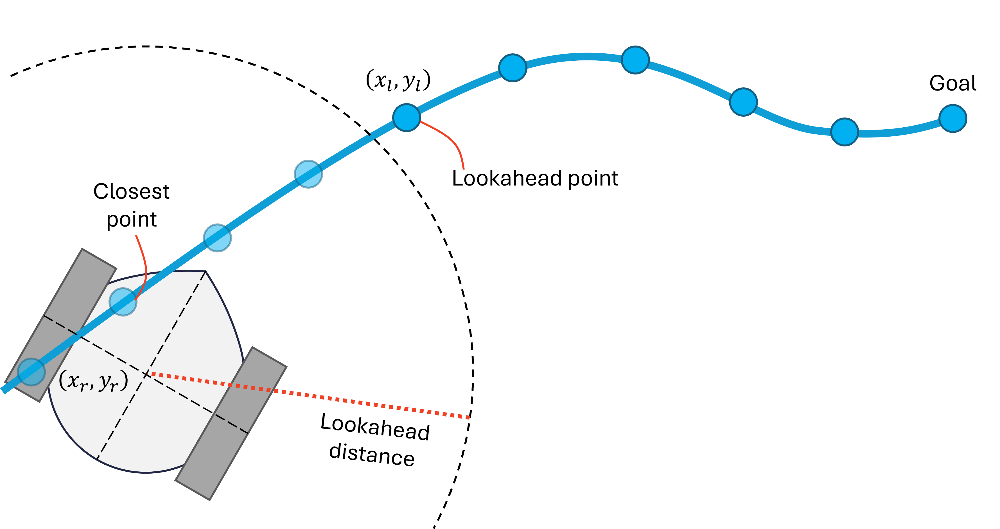
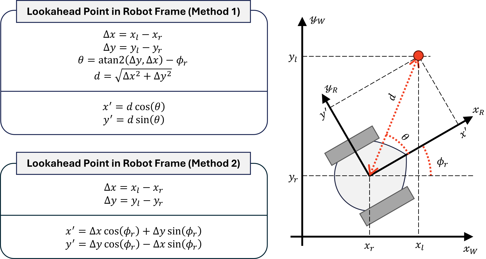
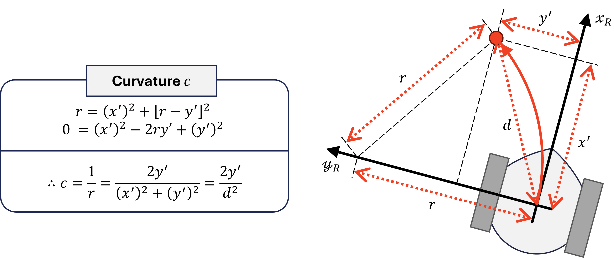
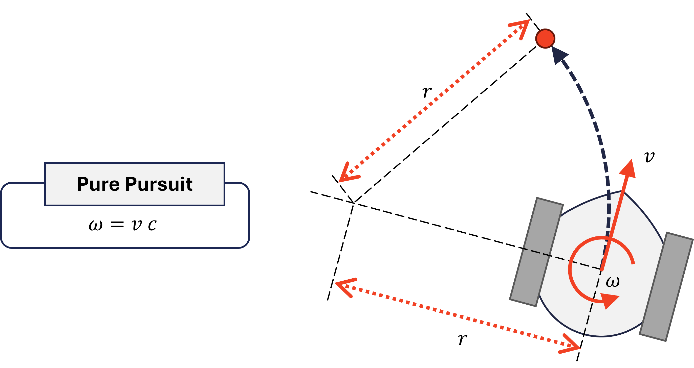
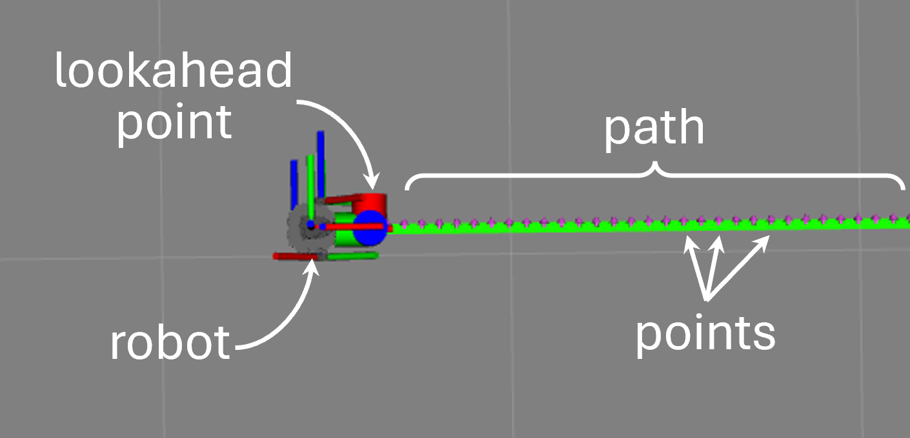

4&emsp;Pure Pursuit Controller
---

***EE3305/ME3243 Robotic System Design***

**&copy; Lai Yan Kai, National University of Singapore**

The pure pursuit controller will be implemented in this chapter.

# Table of Contents

[1&emsp;Background](#1background)

[2&emsp;Relevant Files](#2relevant-files)

[3&emsp;Implement `getLookaheadPoint_()`](#3implement-getlookaheadpoint_)

&emsp;[3.1&emsp;Pseudocode](#31pseudocode)

&emsp;[3.2&emsp;Relevant Variables and Functions](#32relevant-variables-and-functions)

[4&emsp;Implement `callbackTimer_()`](#4implement-callbacktimer_)

&emsp;[4.1&emsp;Pseudocode](#41pseudocode)

&emsp;[4.2&emsp;Variables and Functions](#42variables-and-functions)

[5&emsp;Building and Testing](#5building-and-testing)

[6&emsp;Tasks](#6tasks)

# 1&emsp;Background

Pure pursuit finds the **lookahead point** along a path that is at least a lookahead-distance away from the closest point.



Let the lookahead point's coordinates in the **world frame** be $(x_l, y_l)$, and its coordinates in the **robot frame** be $(x', y')$. 
Suppose the robot's coordinates in the world frame be $(x_r, y_r)$, with a heading that is $\phi_r$. The following relationship can be derived:



The curvature required to move the robot to the lookahead point is the inverse of the turn radius required to reach it.



The linear forward velocity $v$ is a constant velocity that is decided by the programmer, and the yaw angular velocity $\omega$ is calculated as $\omega = v c$.




# 2&emsp;Relevant Files
The following files will be relevant for this task.

<table><tbody>
    <tr>
        <th>Name</th>
        <th>Where</th>
        <th>Description</th>
    </tr>
    <tr>
        <td rowspan="2">Controller code</td>
        <td>Python file located in <a href="../src/ee3305_py/ee3305_py/controller.py"><code>src/ee3305_py/ee3305_py/controller.py</code></a></td>
        <td rowspan="2">Program the controller in this file.</td>
    </tr>
    <tr>
        <td>C++ file located in <a href="../src/ee3305_cpp/src/controller.cpp"><code>src/ee3305_cpp/src/controller.cpp</code></a></td>
    </tr>
    <tr>
        <td>Parameter File</td>
        <td><a href="../src/ee3305_bringup/params/run.yaml"><code>src/ee3305_bringup/params/run.yaml</code></a></td>
        <td>Contains parameter values that are fed into the programs when launched. Modifications do not require re-building.</td>
    </tr>
</tbody></table>


# 3&emsp;Implement `getLookaheadPoint_()`

Ensure that the topics have been implemented in [03_ROS_System.md](03_ROS_System.md).

The function returns the lookahead point based on the path received from the path planner node. Keep in mind that the lookahead point must be at least some distance away from the robot.

## 3.1&emsp;Pseudocode

1. **Function** getLookaheadPoint_()
2. &emsp;Find the point along the path that is closest to the robot. 
3. &emsp;From the closest point, proceed towards the goal and find the lookahead point.
4. &emsp;**If** no lookahead point can be found **Then**
5. &emsp;&emsp;The goal point becomes the lookahead point.
6. &emsp;**End If**
7. &emsp;Publish the lookahead point.
8. &emsp;**Return** coordinates of lookahead point.
9. **End Function**

## 3.2&emsp;Relevant Variables and Functions

The following class properties and functions may be helpful.
<table><tbody>
    <tr>
        <th>Variable / Function</th>
        <th>Type</th>
        <th>Description</th>
    </tr>
    <tr>
        <td><code>path_poses_</code></td>
        <td>Class property</td>
        <td>The copied path message found by the planner. Do not write to it.</td>
    </tr>
    <tr>
        <td><code>rbt_x_</code></td>
        <td>Class property</td>
        <td>The robot's current x-coordinate (m). Do not write to it.</td>
    </tr>
    <tr>
        <td><code>rbt_y_</code></td>
        <td>Class property</td>
        <td>The robot's current y-coordinate (m). Do not write to it.</td>
    </tr>
    <tr>
        <td><code>lookahead_distance_</code></td>
        <td>Class property</td>
        <td>The lookahead distance (m). Can be specified in the <code>run.yaml</code> parameter file. Do not write to it.</td>
    </tr>
    <tr>
        <td><code>hypot()</code></td>
        <td>Function</td>
        <td>Calculates distance. Google how to use.</td>
    </tr>
</tbody></table>

An example to use the properties on Python and C++ are as follows.

<table><tbody>
    <tr>
        <td><b>Python</b></td>
        <td>
<pre lang="python">
# assume point_x and point_y contains a point's coordinates
distance = hypot(point_x - self.rbt_x_, point_y - self.rbt_y_)
if distance > self.lookahead_distance_:
    self.get_logger().info(f"distance: {distance:.3f}")
</pre>
        </td>
    </tr>
    <tr>
        <td><b>C++</b></td>
        <td>
<pre lang="cpp">
// assume point_x and point_y contains a point's coordinates
double distance = hypot(point_x - this->rbt_x_, point_y - this->rbt_y_);
if (distance > this->lookahead_distance_)
{
    RCLCPP_INFO(this->get_logger(), "distance: %.3f", distance);
}
</pre>
        </td>
    </tr>
</tbody></table>


# 4&emsp;Implement `callbackTimer_()`

Ensure that the topics have been implemented in [03_ROS_System.md](03_ROS_System.md).

The `callbackTimer_()` function implements **an iteration** of the pure pursuit controller. 
The function is called at regular intervals (about 20 times per second) to move the robot.
In the function, `getLookaheadPoint_()` is called find the lookahead point. 
The function subsequently calculates the linear and angular velocities to move the robot to this point, and publishes the velocities.

## 4.1&emsp;Pseudocode

1. **Function** callbackTimer_()
2. &emsp;**If** odometry not received **Or** path not received **Then** 
3. &emsp;&emsp;**Return** &emsp;&emsp;&#x25B6; *No messages received yet.* 
4. &emsp;**End If**
5. &emsp;Get lookahead point from `getLookaheadPoint_()`. 
6. &emsp;**If** the robot is close to the lookahead point **Then**
7. &emsp;&emsp;Publish zero velocities to stop the robot.
8. &emsp;&emsp;**Return**
9. &emsp;**End If**
10. &emsp;Calculate the curvature.
11. &emsp;Calculate angular velocity.
12. &emsp;Constrain the linear and angular velocities.
13. &emsp;Publish the velocities.
14. **End Function**

## 4.2&emsp;Variables and Functions

The following class properties and functions may be helpful.
<table><tbody>
    <tr>
        <th>Variable / Function</th>
        <th>Type</th>
        <th>Description</th>
    </tr>
    <tr>
        <td><code>rbt_x_</code></td>
        <td>Class property</td>
        <td>The robot's current x-coordinate (m). Do not write to it.</td>
    </tr>
    <tr>
        <td><code>rbt_y_</code></td>
        <td>Class property</td>
        <td>The robot's current y-coordinate (m). Do not write to it.</td>
    </tr>
    <tr>
        <td><code>rbt_yaw_</code></td>
        <td>Class property</td>
        <td>The robot's current yaw heading (rad). Do not write to it.</td>
    </tr>
    <tr>
        <td><code>stop_thres_</code></td>
        <td>Class property</td>
        <td>The distance (m) from the goal where the robot is allowed to stop. Can be specified in the <code>run.yaml</code> parameter file. Do not write to it.</td>
    </tr>
    <tr>
        <td><code>lookahead_lin_vel_</code></td>
        <td>Class property</td>
        <td>The lookahead linear velocity (m/s). Can be specified in the <code>run.yaml</code> parameter file. Do not write to it.</td>
    </tr>
    <tr>
        <td><code>max_lin_vel_</code></td>
        <td>Class property</td>
        <td>The maximum linear speed (m/s). Can be specified in the <code>run.yaml</code> parameter file. Do not write to it.</td>
    </tr>
    <tr>
        <td><code>max_ang_vel_</code></td>
        <td>Class property</td>
        <td>The maximum angular speed (rad/s). Can be specified in the <code>run.yaml</code> parameter file. Do not write to it.</td>
    </tr>
    <tr>
        <td><code>sin()</code></td>
        <td>Function</td>
        <td>Returns the sine of an angle.</td>
    </tr>
    <tr>
        <td><code>cos()</code></td>
        <td>Function</td>
        <td>Returns the cosine of an angle.</td>
    </tr>
    <tr>
        <td><code>clamp()</code></td>
        <td>Function (C++ only)</td>
        <td>Clamps a value to a minimum and maximum value. Google how to use.</td>
    </tr>
    <tr>
        <td><code>min()</code></td>
        <td>Function</td>
        <td>Calculates the minimum.</td>
    </tr>
    <tr>
        <td><code>max()</code></td>
        <td>Function</td>
        <td>Calculates the maximum.</td>
    </tr>
</tbody></table>

# 5&emsp;Building and Testing

1. If required, build the workspace. 
Workspace must be re-built if C++ files are changed, and for Python if `--symlink-install` was **not** used in a prior build.

    ```bash
    cd ~/ee3305  # if terminal is not in workspace
    colcon build --symlink-install
    ```

    If using C++, fix any errors that shows up.

2. Run the following to test the controller. It is the same as the previous chapter. Set `libgl` to `True` if using VirtualBox. Set `cpp` to `True` if using C++.

    ```bash
    cd ~/ee3305                 # if terminal is not in workspace
    source install/setup.bash   # if not already sourced
    ros2 launch ee3305_bringup run.launch.py cpp:=False headless:=False libgl:=False
    ```

3. If implemented correctly,
    - The lookahead point will be visible in RViz as a bulbous red-green-blue axis that is a short distance from the robot.
    - The robot will try to move to the lookahead point.
    - The robot will stop when it is near the goal point, and the lookahead point is at the goal point.

    

# 6&emsp;Tasks

1. Implement the Pure Pursuit Controller based on the sections above.

2. Tune the controller and explain the observations. This may require the planner in the next chapter to be complete. 
The following suggestions may help analysis when tuning a parameter.

    <table><tbody>
        <tr>
            <th>Component</th>
            <th>Description</th>
        </tr>
        <tr>
            <td><b>Methodology</b></td>
            <td>Think of ways to control other parameters so that the effects of a tuned parameter can be observed.</td>
        </tr>
        <tr>
            <td><b>Observation</b></td>
            <td>Observe the behavior of the robot at different values of a tuned parameter.</td>
        </tr>
        <tr>
            <td><b>Explanation</b></td>
            <td>Explain the behavior at different values using theory.</td>
        </tr>
        <tr>
            <td><b>Suggestion</b></td>
            <td>Suggest to a beginner how to use these values. How might one value be preferred in a situation but not another? </td>
        </tr>
    </tbody></table>
    
3. Suggest and **implement** improvements to the Pure Pursuit controller based on any problems identified in the algorithm.
