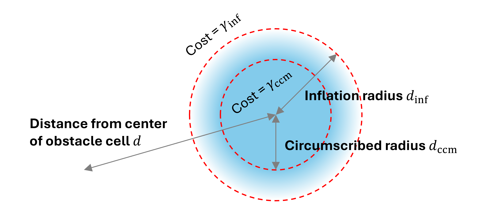

5&emsp;Dijkstra Path Planner
---

***EE3305/ME3243 Robotic System Design***

**&copy; Lai Yan Kai, National University of Singapore**

The Dijkstra path planning algorithm will be implemented in this chapter. 
Path planning algorithms rely on an underlying costmap to plot a path around obstacles.
The code to interface with the costmap will also be implemented.

# Table of Contents

[1&emsp;Background](#1background)

&emsp;[1.1&emsp;Costmap](#11costmap)

&emsp;[1.2&emsp;Inflation Radius and Circumscribed Radius](#12inflation-radius-and-circumscribed-radius)

&emsp;[1.3&emsp;Inflation Cost Function](#13inflation-cost-function)

&emsp;[1.4&emsp;Dijkstra](#14dijkstra)

[2&emsp;Relevant Files](#2relevant-files)

[3&emsp;Implement Service Functions](#3implement-service-functions)

&emsp;[3.1&emsp;`XYToCR_()`](#31xytocr_)

&emsp;[3.2&emsp;`CRToXY_()`](#32crtoxy_)

&emsp;[3.3&emsp;`CRToIndex_()`](#33crtoindex_)

&emsp;[3.4&emsp;`outOfMap_()`](#34outofmap_)

[4&emsp;Implement `dijkstra_()`](#4implement-dijkstra_)

&emsp;[4.1&emsp;Pseudocode](#41pseudocode)

&emsp;[4.2&emsp;Variables and Functions](#42variables-and-functions)

[5&emsp;Building and Testing](#5building-and-testing)

[6&emsp;Tasks](#6tasks)

# 1&emsp;Background

This section focuses on the costmap used by the Dijkstra path planner. The pseudocode for Dijkstra will be shown in a later section.

## 1.1&emsp;Costmap

The costmap contains different costs in each cell. The costs are between 0 to 99. The path planner will use these costs to plan a path, and will attempt to avoid cells with large costs.

The following image describes the costmap at zero rotation from the world axis and in ROS2's convention.


The following image describes how the map cells are flattened using row-major order so that the map can be stored as a Python list or C++ vector.


## 1.2&emsp;Inflation Radius and Circumscribed Radius

The inflation radius and circumscribed radius are radii that determine how close the robot is able to get to an obstacle.

The **inflation radius** determines the distance from obstacles where the costs begin to increase. 
It is usually larger than the robot's radius.

The **circumscribed radius** is the smallest radius of the robot. If a path is plotted on cells that are this distance from an obstacle, a collision will occur.


The radii are used to inflate (increase) the costs of the map cells that are close to obstacles, penalizing any paths that are near the obstacles.


## 1.3&emsp;Inflation Cost Function

The cost function determines the cost assigned to cells and depends on the inflation and circumscribed radii.
In ROS2 Nav2 (a popular navigation utility) the exponential decay is used (see Fig 13 [here](https://kaiyuzheng.me/documents/navguide.pdf)). 
The decaying curve generates a relatively long decay tail that may not be as versatile as using a polynomial function. 
In this project, the polynomial function is used and is tunable from the `run.yaml` parameter file.




## 1.4&emsp;Dijkstra

Dijkstra relies on a priority queue to find the shortest path. See below for the pseudocode.

# 2&emsp;Relevant Files
The following files will be relevant for this task.

<table><tbody>
    <tr>
        <th>Name</th>
        <th>Where</th>
        <th>Description</th>
    </tr>
    <tr>
        <td rowspan="2">Planner code</td>
        <td>Python file located in <a href="../src/ee3305_py/ee3305_py/planner.py"><code>src/ee3305_py/ee3305_py/planner.py</code></a></td>
        <td rowspan="2">Program Dijkstra in this file.</td>
    </tr>
    <tr>
        <td>C++ file located in <a href="../src/ee3305_cpp/src/planner.cpp"><code>src/ee3305_cpp/src/planner.cpp</code></a></td>
    </tr>
    <tr>
        <td>Parameter File</td>
        <td><a href="../src/ee3305_bringup/params/run.yaml"><code>src/ee3305_bringup/params/run.yaml</code></a></td>
        <td>Contains parameter values that are fed into the programs when launched. Modifications do not require re-building.</td>
    </tr>
</tbody></table>

# 3&emsp;Implement Service Functions

These functions makes it easier to interface with the costmap. Implement every function so that it can be used from the main path planning function `dijkstra_()`.

## 3.1&emsp;`XYToCR_()`

<table><tbody>
    <tr>
        <td><b>Description</b></td>
        <td colspan="2">Converts world coordinates (x,y) to map coordinates (c,r). The world coordinates are floating numbers, and the map coordinates are integers.</th>
    </tr>
    <tr>
        <td rowspan="2"><b>Arguments</b></td>
        <td><code>x</code></td>
        <td>The world coordinate x.</td>
    </tr>
    <tr>
        <td><code>y</code></td>
        <td>The world coordinate y.</td>
    </tr>
    <tr>
        <td><b>Returns</b></td>
        <td colspan="2">The map coordinates (c,r).</td>
    </tr>
</tbody></table>

The following class properties and functions may be useful.

<table><tbody>
    <tr>
        <th>Variable / Function</th>
        <th>Type</th>
        <th>Description</th>
    </tr>
    <tr>
        <td><code>costmap_origin_x_</code></td>
        <td>Class property</td>
        <td>The x world coordinate (m) at the bottom-left corner of the map.</td>
    </tr>
    <tr>
        <td><code>costmap_origin_y_</code></td>
        <td>Class property</td>
        <td>The y world coordinate (m) at the bottom-left corner of the map.</td>
    </tr>
    <tr>
        <td><code>costmap_resolution_</code></td>
        <td>Class property</td>
        <td>The length of each cell (m) in the world.</td>
    </tr>
    <tr>
        <td><code>floor()</code></td>
        <td>Function</td>
        <td>Floors a number.</td>
    </tr>
</tbody></table>

An example to use the properties on Python and C++ are as follows. The example is logically wrong.

<table><tbody>
    <tr>
        <td><b>Python</b></td>
        <td>
<pre lang="python">
def XYToCR_(self, x, y):
    dx = x * self.costmap_resolution_ + self.costmap_origin_x_
    c = floor(dx)
    r = 0
    return c, r
</pre>
        </td>
    </tr>
    <tr>
        <td><b>C++</b></td>
        <td>
<pre lang="cpp">
std::pair&lt;int, int&gt; XYToCR_(double x, double y)
{
    double dx = x * this->costmap_resolution_ + this->costmap_origin_x_;
    int c = floor(dx);
    int r = 0;
    return {c, r};
}
</pre>
        </td>
    </tr>
</tbody></table>

## 3.2&emsp;`CRToXY_()`

<table><tbody>
    <tr>
        <td><b>Description</b></td>
        <td colspan="2">Converts map coordinates (c,r) to map coordinates (x,y). The world coordinates should be at the center of the cell at (c,r).</th>
    </tr>
    <tr>
        <td rowspan="2"><b>Arguments</b></td>
        <td><code>c</code></td>
        <td>The map coordinate which corresponds to the column of the cell.</td>
    </tr>
    <tr>
        <td><code>r</code></td>
        <td>The map coordinate which corresponds to the row of the cell.</td>
    </tr>
    <tr>
        <td><b>Returns</b></td>
        <td colspan="2">The world coordinates (x,y), which is at the center of the cell.</td>
    </tr>
</tbody></table>

The following class properties and functions may be useful.

<table><tbody>
    <tr>
        <th>Variable / Function</th>
        <th>Type</th>
        <th>Description</th>
    </tr>
    <tr>
        <td><code>costmap_origin_x_</code></td>
        <td>Class property</td>
        <td>The x world coordinate (m) at the bottom-left corner of the map.</td>
    </tr>
    <tr>
        <td><code>costmap_origin_y_</code></td>
        <td>Class property</td>
        <td>The y world coordinate (m) at the bottom-left corner of the map.</td>
    </tr>
    <tr>
        <td><code>costmap_resolution_</code></td>
        <td>Class property</td>
        <td>The length of each cell (m) in the world.</td>
    </tr>
</tbody></table>

## 3.3&emsp;`CRToIndex_()`

<table><tbody>
    <tr>
        <td><b>Description</b></td>
        <td colspan="2">Converts map coordinates (c,r) to the corresponding flattened index. The index is used to access the C++ vector or Python list that stores the costmap.</th>
    </tr>
    <tr>
        <td rowspan="2"><b>Arguments</b></td>
        <td><code>c</code></td>
        <td>The map coordinate which corresponds to the column of the cell.</td>
    </tr>
    <tr>
        <td><code>r</code></td>
        <td>The map coordinate which corresponds to the row of the cell.</td>
    </tr>
    <tr>
        <td><b>Returns</b></td>
        <td colspan="2">The flattened index.</td>
    </tr>
</tbody></table>

The following class properties and functions may be useful. **Only one needs to be used**.

<table><tbody>
    <tr>
        <th>Variable / Function</th>
        <th>Type</th>
        <th>Description</th>
    </tr>
    <tr>
        <td><code>costmap_cols_</code></td>
        <td>Class property</td>
        <td>The number of cell columns in the map before flattening.</td>
    </tr>
    <tr>
        <td><code>costmap_rows_</code></td>
        <td>Class property</td>
        <td>The number of cell rows in the map before flattening.</td>
    </tr>
</tbody></table>

## 3.4&emsp;`outOfMap_()`

<table><tbody>
    <tr>
        <td><b>Description</b></td>
        <td colspan="2">Determines if the map coordinate (c,r) is represented by the map, returning a logical false if so.</th>
    </tr>
    <tr>
        <td rowspan="2"><b>Arguments</b></td>
        <td><code>c</code></td>
        <td>The map coordinate which corresponds to the column of the cell.</td>
    </tr>
    <tr>
        <td><code>r</code></td>
        <td>The map coordinate which corresponds to the row of the cell.</td>
    </tr>
    <tr>
        <td><b>Returns</b></td>
        <td colspan="2">Logical true if (c,r) is not in the map. Logical false if (c,r) is in the map.</td>
    </tr>
</tbody></table>

The following class properties and functions may be useful.

<table><tbody>
    <tr>
        <th>Variable / Function</th>
        <th>Type</th>
        <th>Description</th>
    </tr>
    <tr>
        <td><code>costmap_cols_</code></td>
        <td>Class property</td>
        <td>The number of cell columns in the map before flattening.</td>
    </tr>
    <tr>
        <td><code>costmap_rows_</code></td>
        <td>Class property</td>
        <td>The number of cell rows in the map before flattening.</td>
    </tr>
</tbody></table>

# 4&emsp;Implement `dijkstra_()`
Find the `dijkstra()` function and implement the following pseudocode. 

Ensure that the service functions above, and the topics from [03_ROS_System.md](03_ROS_System.md), have been implemented.

The `publishInterpolatedPath()` function and immediate `return` keyword in `dijkstra()` may have to be **deleted** or **commented out**.

To understand Dijkstra better, the lecture notes and the visualization at https://planners-js.vercel.app/ can be used. (Docs for the visualization at https://planners-js-docs.vercel.app/UserGuide.html#quick-start). 

## 4.1&emsp;Pseudocode

1. **Function** dijkstra()
2. &emsp;Initialize empty open-list.
3. &emsp;Initialize all nodes with $\infty$ $g$-cost and no parent.
4. &emsp;Initialize start node with $0$ $g$-cost.
5. &emsp;Queue start node into open-list.
6. &emsp;**While** open-list **not** empty **Do** &emsp;&emsp;&#x25B6; *Expansion Loop.* 
7. &emsp;&emsp; $n$ &larr; cheapest $g$-cost node polled from open-list.
8. &emsp;&emsp;**If** $n$ was previously expanded **Then**
9. &emsp;&emsp;&emsp;**Continue**
10. &emsp;&emsp;**End If**
11. &emsp;&emsp;Mark $n$ as expanded.
12. &emsp;&emsp;**If** $n$ is at goal **Then**
13. &emsp;&emsp;&emsp;Find a preliminary path by iterating from the $n$ to start node. 
14. &emsp;&emsp;&emsp;Convert the path from map coordinates (c,r) to world coordinates (x,y).
15. &emsp;&emsp;&emsp;Reverse the path so that the goal is at the back of the path.
16. &emsp;&emsp;&emsp;**Return** path. 
17. &emsp;&emsp;**End If**
18. &emsp;&emsp;**For** neighbor node $m$ of $n$ **Do** &emsp;&emsp;&#x25B6; *Neighbor loop* 
19. &emsp;&emsp;&emsp;**If** $m$ is not accessible **or** $m$ is expanded **Then**
20. &emsp;&emsp;&emsp;&emsp;**Continue** &emsp;&emsp;&#x25B6; *Out of map, obstacle, or expanded.*
21. &emsp;&emsp;&emsp;**End If**
22. &emsp;&emsp;&emsp; $\tilde{g}$ &larr; $g$-cost of $n$ $+$ (distance between $n$ and $m$) $\times$ (map cost at $m$ + 1)
23. &emsp;&emsp;&emsp;**If** $\tilde{g} <$ $g$-cost of $m$ **Then**
24. &emsp;&emsp;&emsp;&emsp; $g$-cost of $m$ &larr; $\tilde{g}$
25. &emsp;&emsp;&emsp;&emsp;parent of $m$ &larr; $n$
26. &emsp;&emsp;&emsp;&emsp;Queue $m$ into the open-list with the new $g$-cost of $m$.
27. &emsp;&emsp;&emsp;**End If**
28. &emsp;&emsp;**End For**
29. &emsp;**End While**
30. &emsp;**Return** no path.
31. **End Function**

## 4.2&emsp;Variables and Functions

The following class properties and functions may be helpful. The list may not be complete, and it **excludes service functions** from above. 
<table><tbody>
    <tr>
        <th>Variable / Function</th>
        <th>Type</th>
        <th>Description</th>
    </tr>
    <tr>
        <td><code>max_access_cost_</code></td>
        <td>Class property</td>
        <td>Cells with map costs that are larger than this value should be considered inaccessible. Do not write to it.</td>
    </tr>
    <tr>
        <td><code>costmap_</code></td>
        <td>Class property</td>
        <td>The flattened costmap containing map costs. Do not write to it.</td>
    </tr>
    <tr>
        <td><code>DijkstraNode</code></td>
        <td>Class</td>
        <td>A class that implements the node in a Dijkstra algorithm.</td>
    </tr>
    <tr>
        <td>
            <code>heappush(open_list, n)</code> for Python.<br/>
            <code>open_list.push(n)</code> for C++.
        </td>
        <td>Function</td>
        <td>Pushes a node into the open list.</td>
    </tr>
    <tr>
        <td>
            <code>l.reverse()</code> for Python.<br/>
            <code>reverse(l, l.begin(), l.end())</code> for C++.
        </td>
        <td>Function</td>
        <td>Reverses <code>l</code>, which is a C++ vector or Python list.</td>
    </tr>
    <tr>
        <td><code>hypot()</code></td>
        <td>Function</td>
        <td>Calculates the Euclidean distance. This distance metric can be used in this project.</td>
    </tr>
</tbody></table>


# 5&emsp;Building and Testing

1. If required, build the workspace. 
Workspace must be re-built if C++ files are changed, and for Python if `--symlink-install` was **not** used in a prior build.

    ```bash
    cd ~/ee3305  # if terminal is not in workspace
    colcon build --symlink-install
    ```

    If using C++, fix any errors that shows up.

2. Run the following to test the controller. It is the same as the previous chapter. Set `libgl` to `True` if using VirtualBox. Set `cpp` to `True` if using C++.

    ```bash
    cd ~/ee3305                 # if terminal is not in workspace
    source install/setup.bash   # if not already sourced
    ros2 launch ee3305_bringup run.launch.py cpp:=False headless:=False libgl:=False
    ```

3. If implemented correctly, the path should be plotted around obstacles.
    
    


# 6&emsp;Tasks

1. Implement all of the service functions and Dijkstra based on the sections above.

2. Tune the path planner and explain and observations, specifically on the `max_access_cost_` and parameters related to the inflation radii. 
However, more focus should be placed on improving the Dijkstra algorithm than on tuning these parameters. 
The following suggestions may help analysis when tuning a parameter.

    <table><tbody>
        <tr>
            <th>Component</th>
            <th>Description</th>
        </tr>
        <tr>
            <td><b>Methodology</b></td>
            <td>Think of ways to control other parameters so that the effects of a tuned parameter can be observed.</td>
        </tr>
        <tr>
            <td><b>Observation</b></td>
            <td>Observe the behavior of the robot at different values of a tuned parameter.</td>
        </tr>
        <tr>
            <td><b>Explanation</b></td>
            <td>Explain the behavior at different values using theory.</td>
        </tr>
        <tr>
            <td><b>Suggestion</b></td>
            <td>Suggest to a beginner how to use these values. How might one value be preferred in a situation but not another? </td>
        </tr>
    </tbody></table>
    
3. Suggest and **implement** improvements to the Dijkstra algorithm based on any problems identified in the algorithm.
